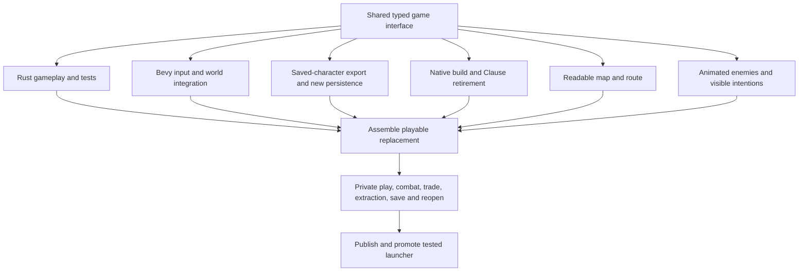

# Rust/Bevy migration

The operator authorized replacing Clause in the shipping game. Preserve the
forest expedition and progress, and deliver a legible map and animated combat.
The old installed release remains usable through the private replacement check.

## Shared interface

The library crate becomes `greywrought`, exporting `game` and `persistence`.
The game module owns `Game`, `Command`, `Snapshot`, `ForestView`,
`ForestThreatView`, `EquipmentView`, `ComponentView`, `BodyPartView` and
`DoctrineView`. The existing native forest/equipment presentation fields are
the read-model contract, with Clause referents replaced by String entity IDs.
`Snapshot` has `forest: ForestView`, `ticks: u64`, and `status: String`.

`Game::new() -> Game`, `Game::command(Command) -> crate::Result<()>`,
`Game::tick() -> crate::Result<()>` (one 16 ms step), and
`Game::snapshot() -> Snapshot` form the core API. Game derives Serde
Serialize/Deserialize; persisted state excludes UI, renderer and OS handles.
The core owner publishes exact command variants and models first. Cross-file
changes require coordination with the owner, not competing duplicate models.

Commands carry typed actions: movement x/z, jump, strike, brace, gather, ritual,
interact, buy/drink potion, rest, threat selection and equipment operations.
Entity IDs use the existing subject names, preserving imported identity.
Expose enemy preparation/action/recovery state, phase progress and action
sequence for animation; presentation does not invent gameplay outcomes.

Persistence exports `load(path: &Path) -> crate::Result<Game>` and
`save(game: &Game, path: &Path) -> crate::Result<()>`. A missing new save starts
a game; malformed saves fail visibly. Use `spatial-rust.json` for the new save,
preserving `spatial.save`. Legacy export is a one-time parent-owned conversion
from the old executable into plain JSON; no Clause code enters the new binary.
The save owner and core owner agree on complete imported state, including gear,
body health, progress, enemy phases and current character tuning where expressible.
Arbitrary saved Clause programs remain recoverable in the previous release.

Bevy integration owns window lifecycle, fixed update/input ordering and errors.
Map and combat modules take the same ForestView and existing camera/asset state.
They may add projection fields through the core owner. Rust gameplay and tests
are authoritative; no general rule interpreter, compiler emulation or proxy.

## Ownership

- Core: new game module and equivalent forest/equipment gameplay tests.
- Frontend: desktop root, controls, forest presentation integration and retiring
  the old inspection/workshop modes. Coordinate new map/combat registration.
- Saves: new persistence module/tests and private old-build exporter/converter.
- Build: manifests, Nix shell/scripts, retired Clause source/tools/fixtures and
  documentation; exclude new game/persistence and frontend-owned files.
- Map: map/route rendering and the minimap section of the parchment HUD.
- Combat: enemy models, animations and world-space intent cues.
- Parent: boundaries, assembled validation, save promotion, publishing/install.

Workers use separate lanes and enumerated commits. Preserve old private evidence.
Only the parent changes the installed selector or the human's saved-game choice.
